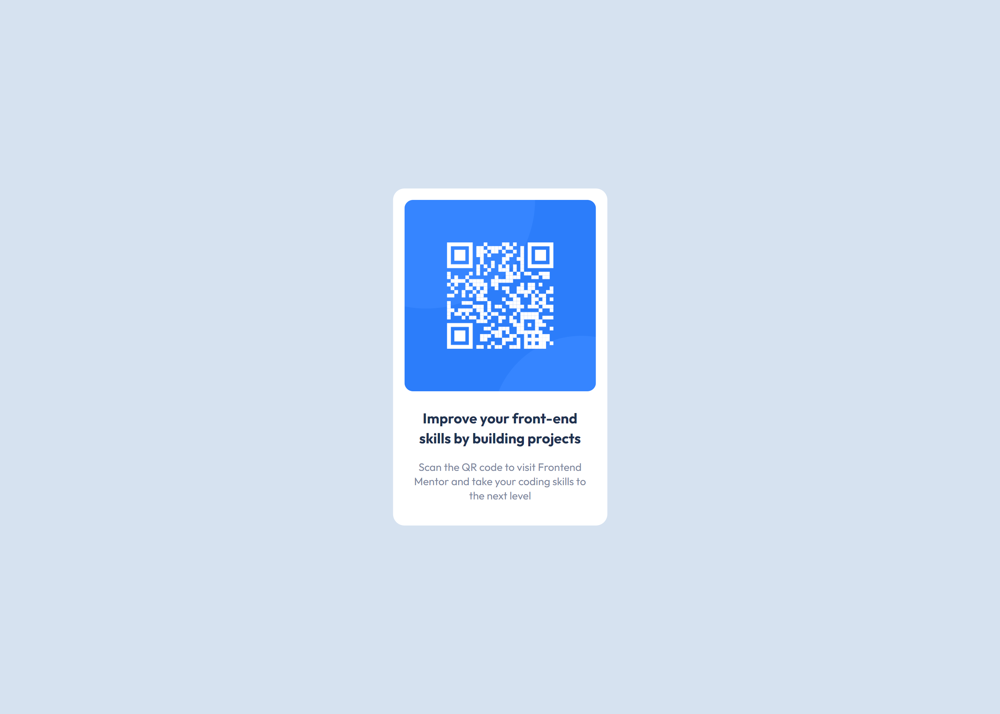

# QR code component

This is a solution to the [QR code component challenge on Frontend Mentor](https://www.frontendmentor.io/challenges/qr-code-component-iux_sIO_H).

Live Site URL: [Github Pages](https://busterb2.github.io/QRCodeComponent/)

 | 

### Built with

-   Semantic HTML5 markup
-   Tailwind CSS
